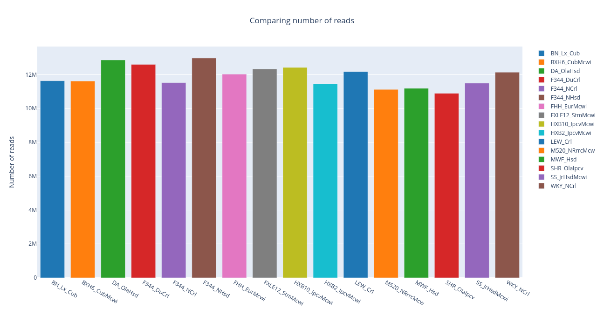
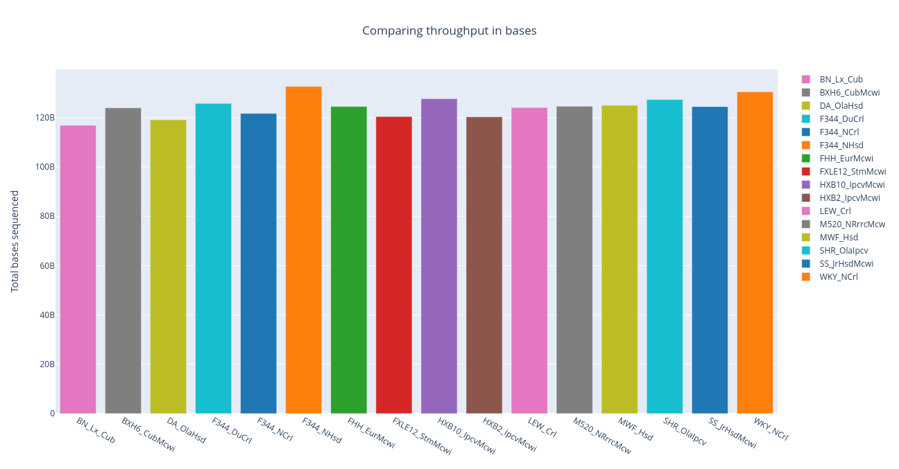
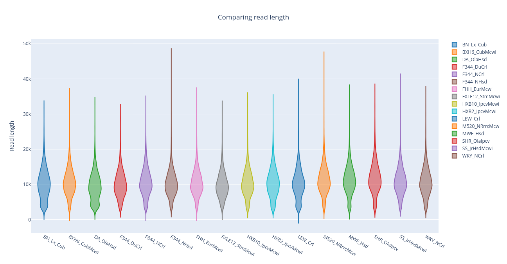
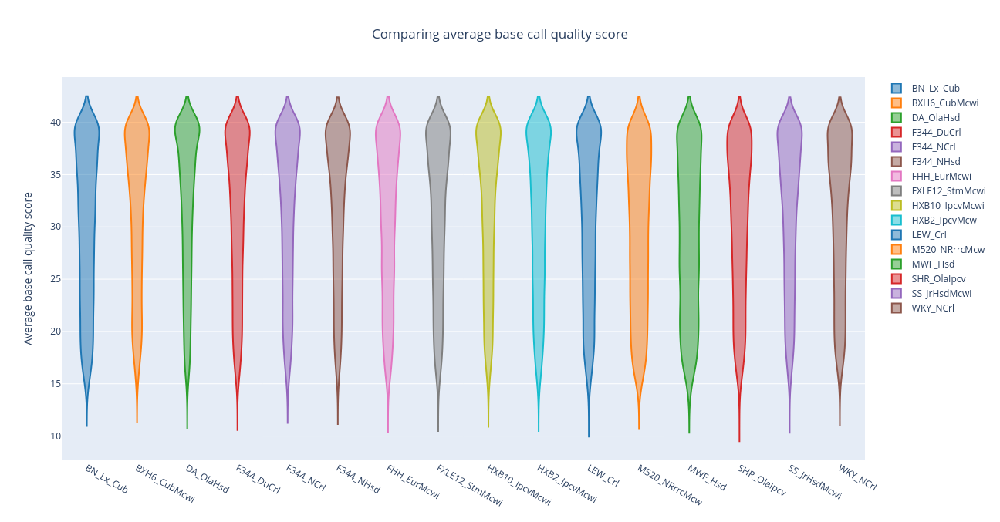
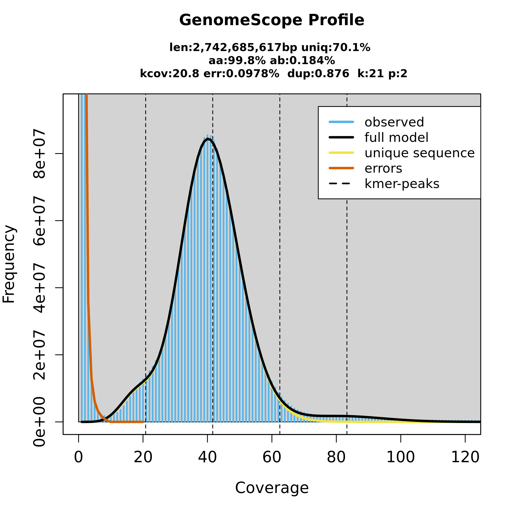
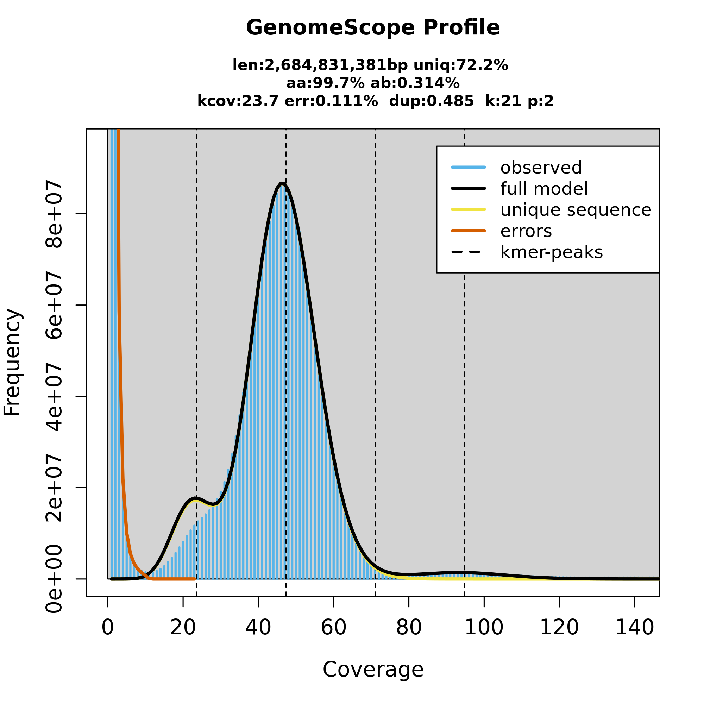
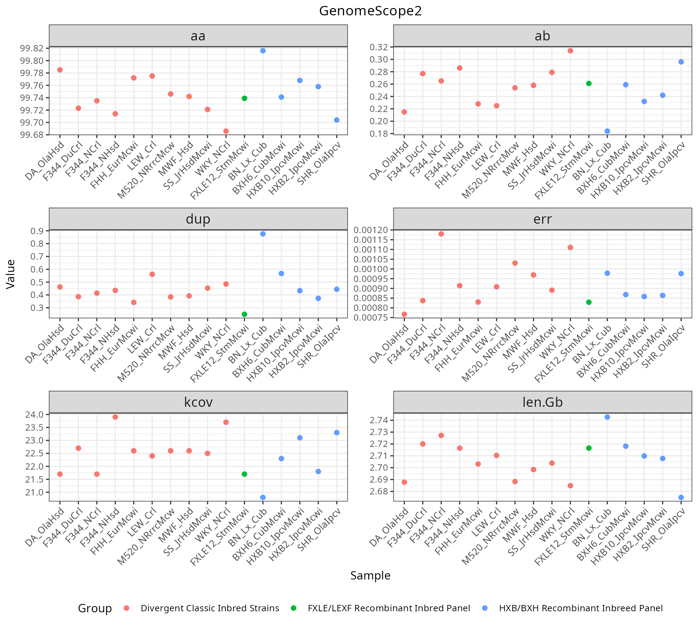
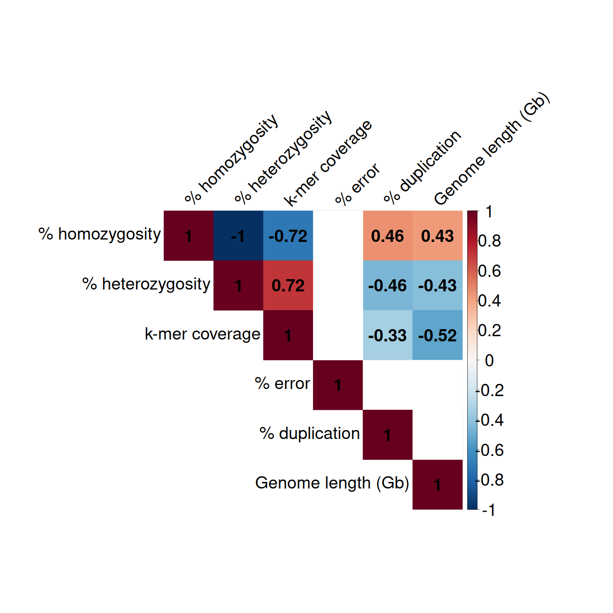

# Reads quality control

## HiFi reads

### NanoComp

### GenomeScope2

<table class="fixed-width-table">
  <tr>
    <th>BN_Lx_Cub</th>
    <th>WKY_NCrl</th>
  </tr>
  <tr>
    <td>
      
    </td>
    <td>
      
    </td>
  </tr>
</table>

All samples 

  

Pearson correlation

