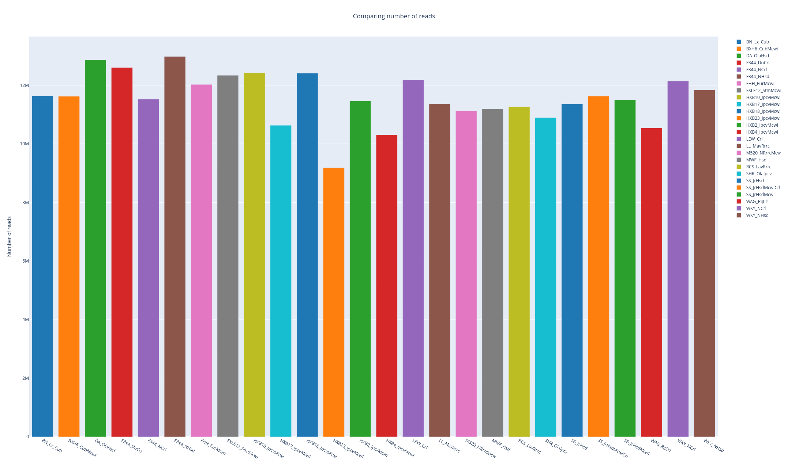
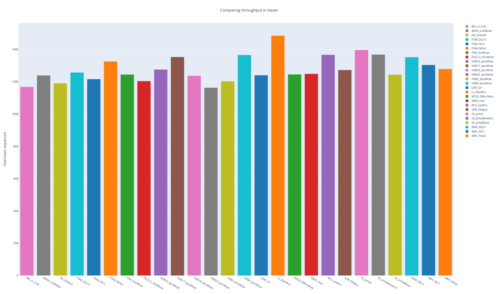
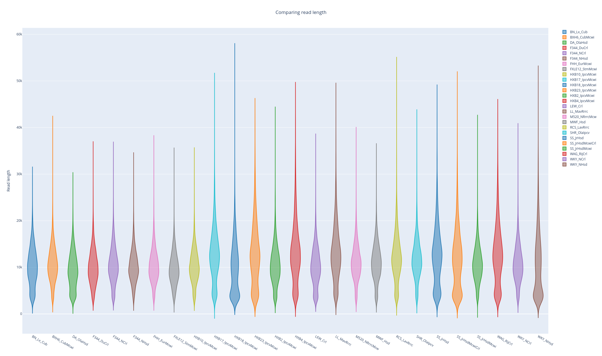
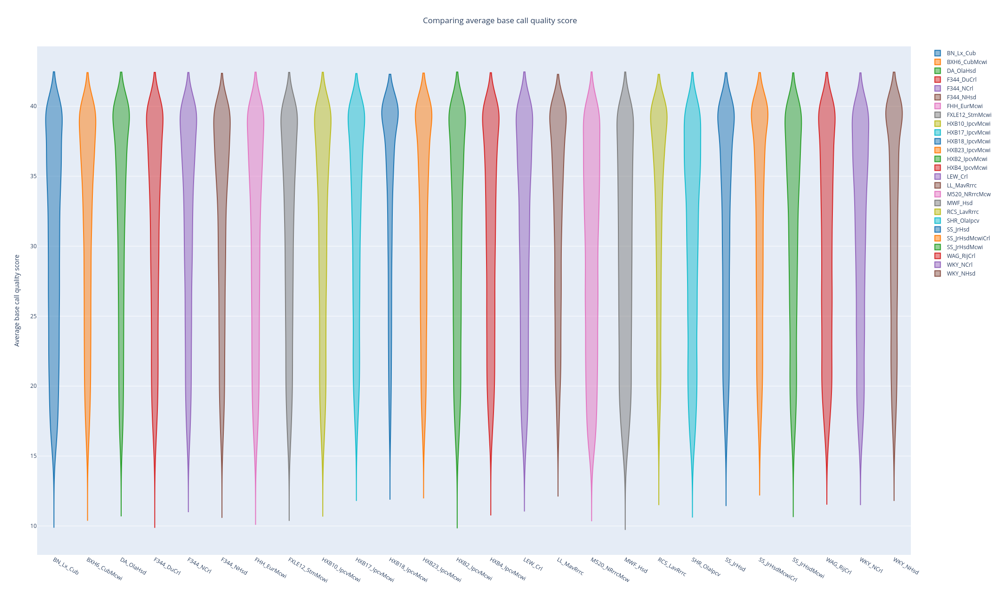
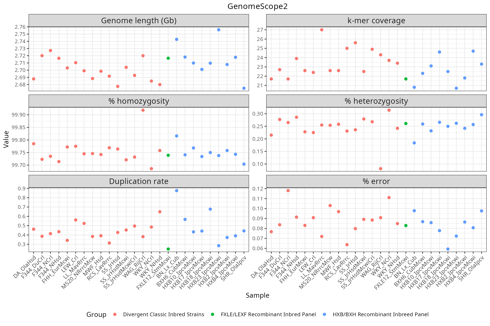
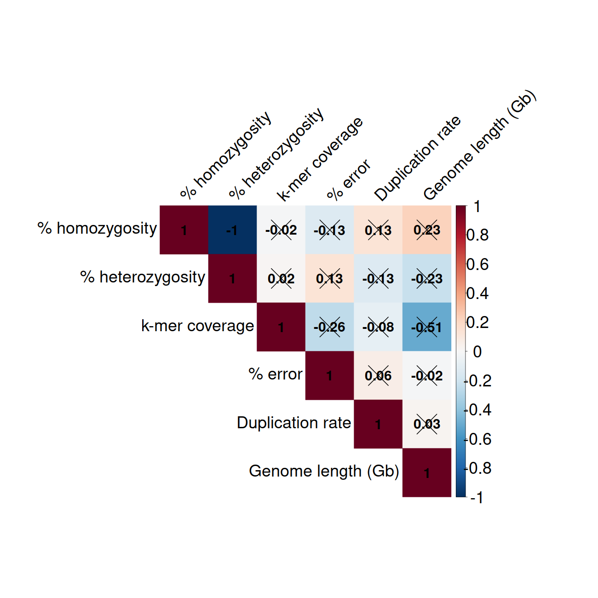

# Reads quality control

## HiFi reads

### NanoComp

### GenomeScope2

<table>
  <tr>
    <th width="50%">BN_Lx_Cub</th>
    <th width="50%">WKY_NCrl</th>
  </tr>
  <tr>
    <td width="50%">
      
    </td>
    <td width="50%">
      
    </td>
  </tr>
</table>

All samples 

  

Pearson correlation

