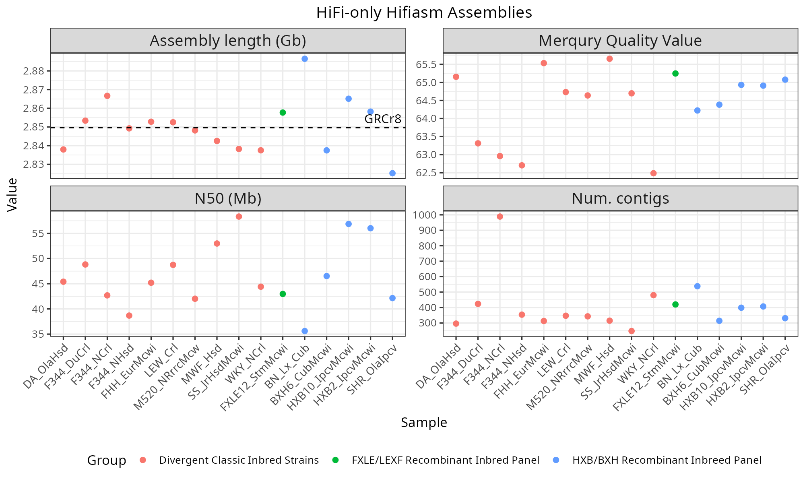
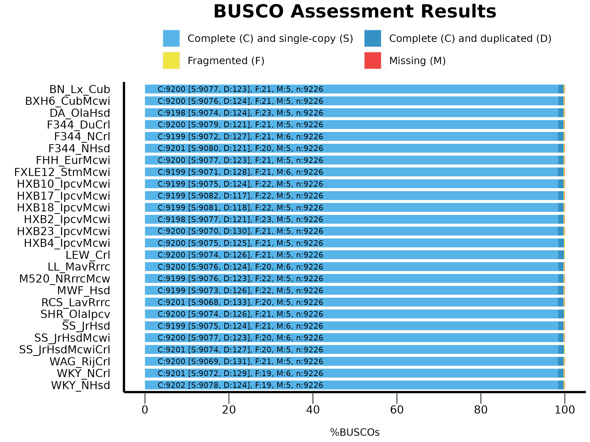
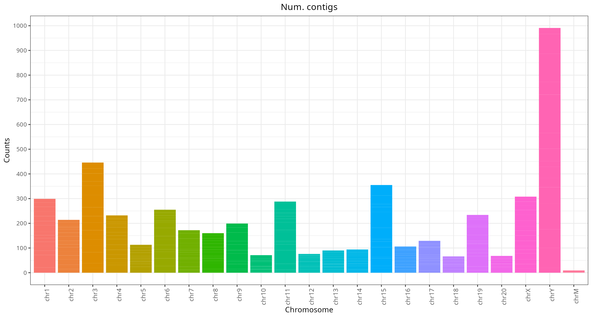

# Assembly quality control

## Hifi-only Hifiasm

### Statistics and Merqury Quality Value (QV)

  rn7 is 2.64 Gb (2,647,915,728 b)
  

  

### BUSCO (compleasm)

<table class="fixed-width-table">
  <tr>
    <th>mammalia</th>
    <th>glires</th>
  </tr>
  <tr>
    <td>
      
    </td>
    <td>
      
    </td>
  </tr>
</table>

### Partitions

  

  

  

