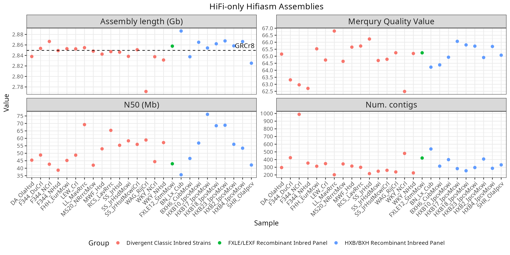
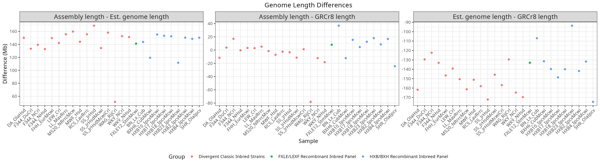
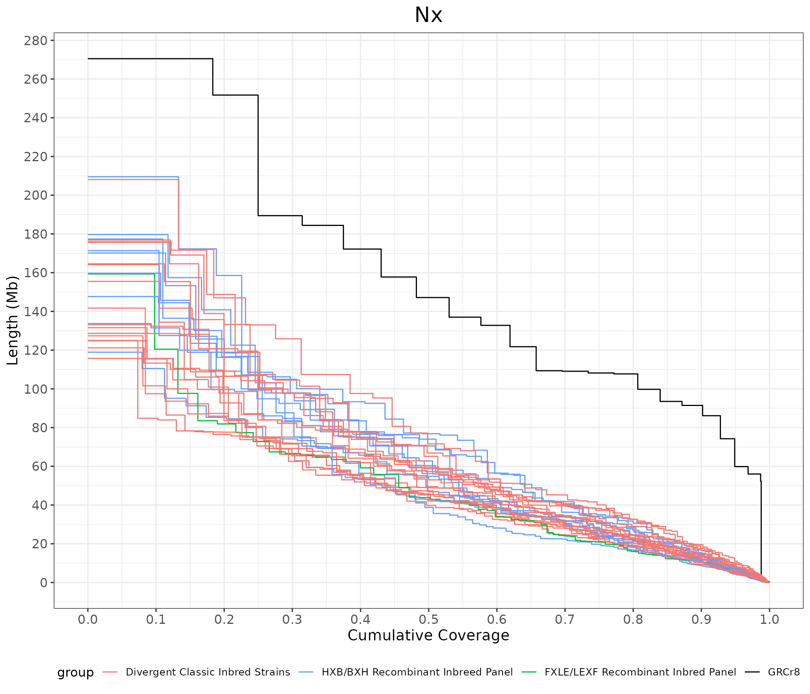
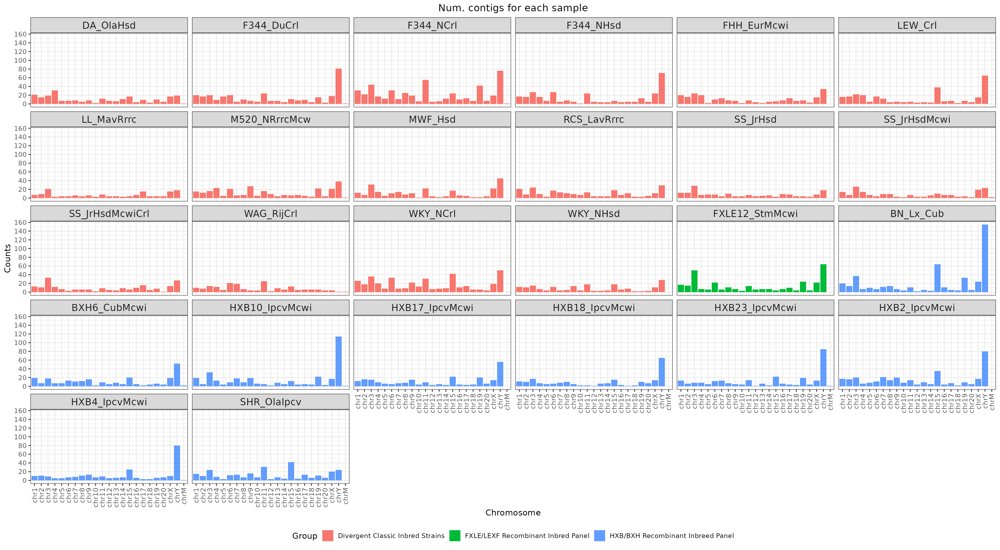
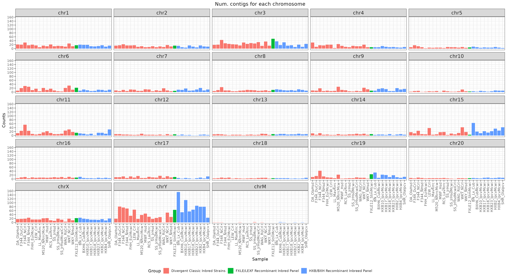
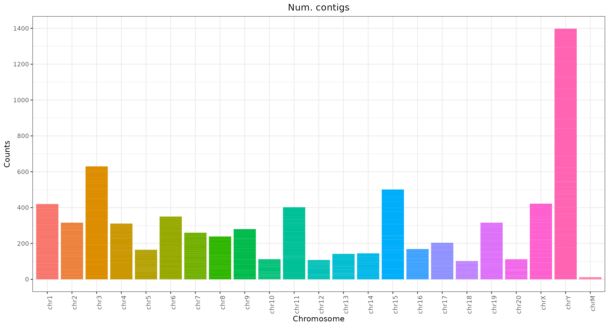

# Assembly quality control

## Hifi-only Hifiasm

### Statistics and Merqury Quality Value (QV)

  rn7 is 2,647,915,728 bps long
  

  

  

### BUSCO (compleasm)

<table>
  <tr>
    <th width="50%">mammalia</th>
    <th width="50%">glires</th>
  </tr>
  <tr>
    <td width="50%">
      
    </td>
    <td width="50%">
      
    </td>
  </tr>
</table>

### Partitions

  

  

  

