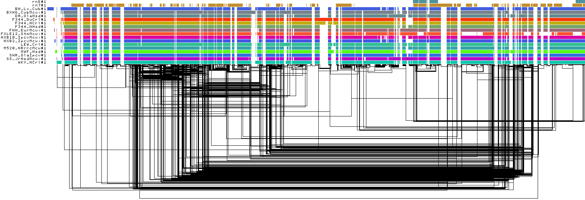
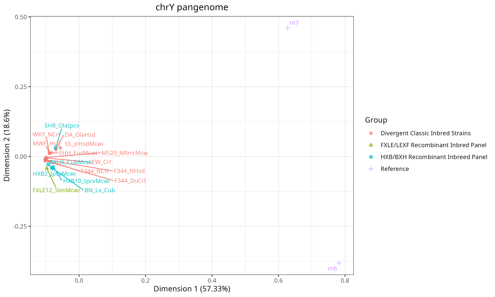
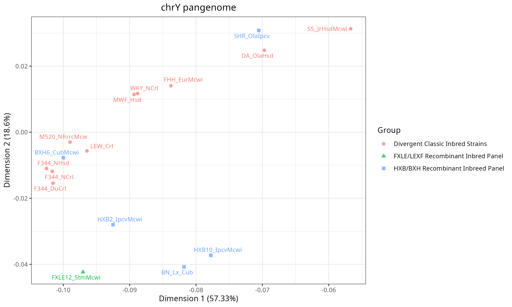
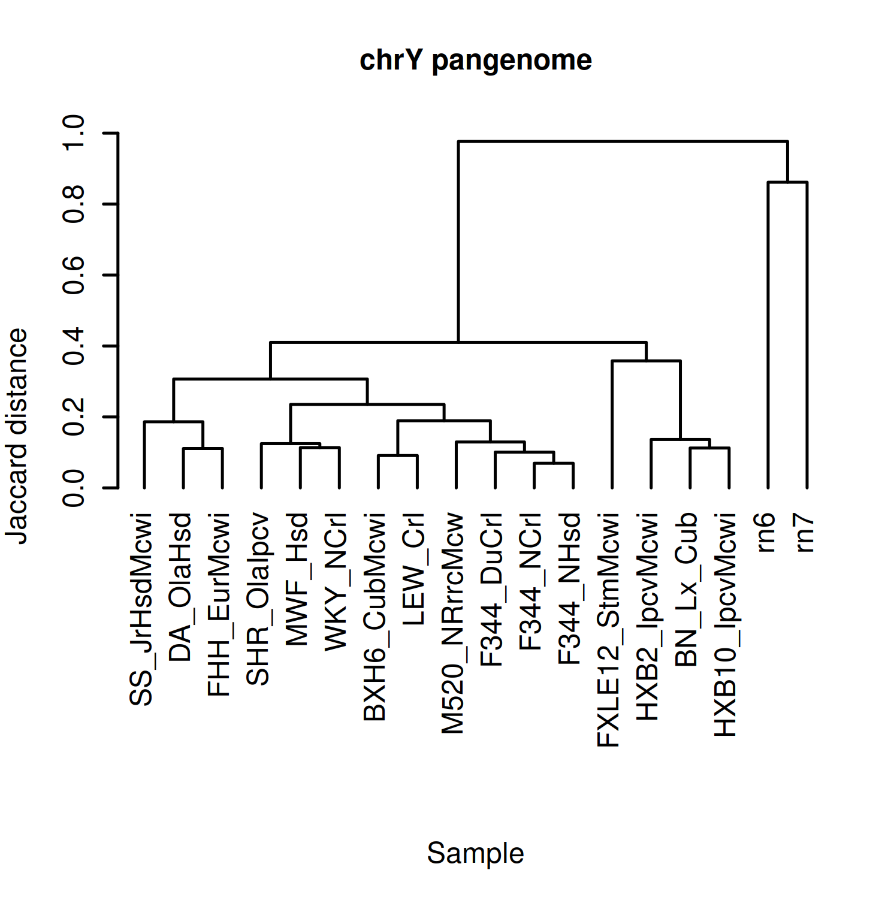

# Pangenome graphs

## chrY

1D graph visualization:

  

PCA:

<table>
  <tr>
    <th width="50%">All samples</th>
    <th width="50%">No references</th>
  </tr>
  <tr>
    <td width="50%">
      
    </td>
    <td width="50%">
      
    </td>
  </tr>
</table>

Phylogenetic tree:

  

